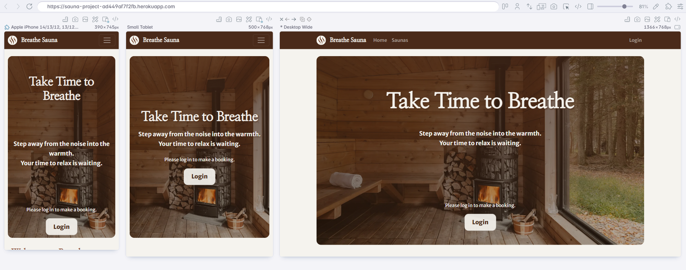
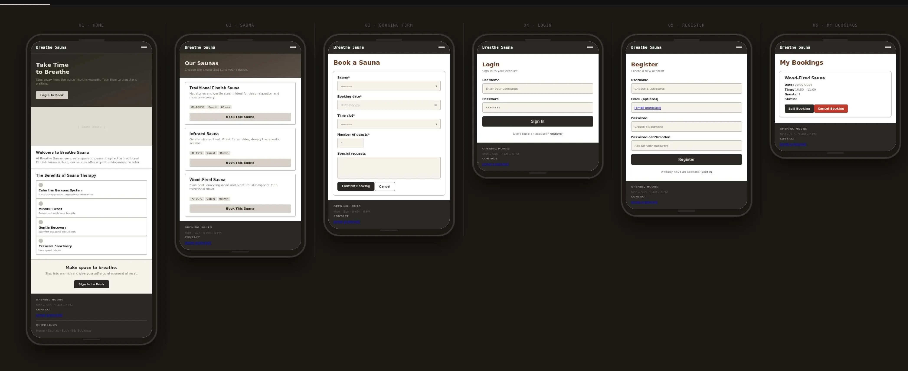
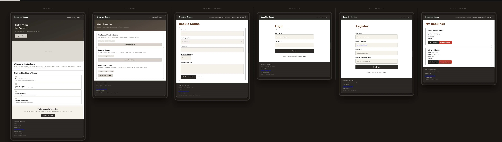
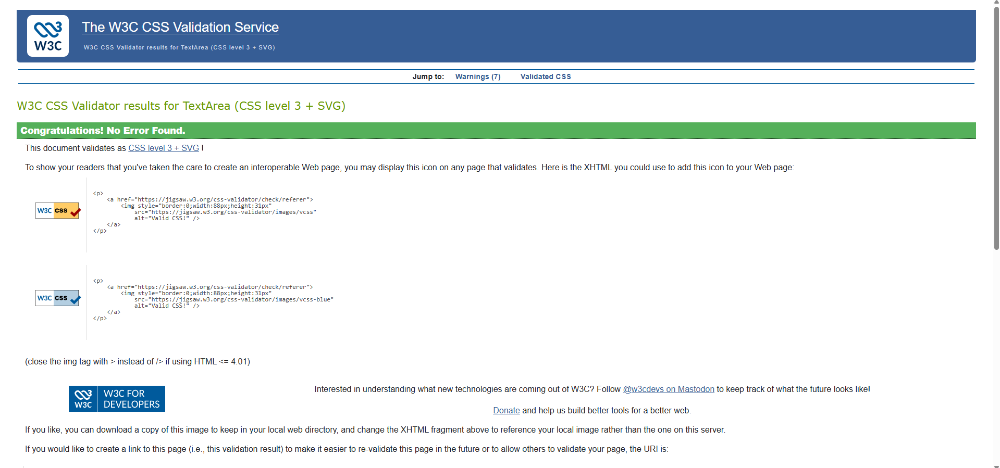
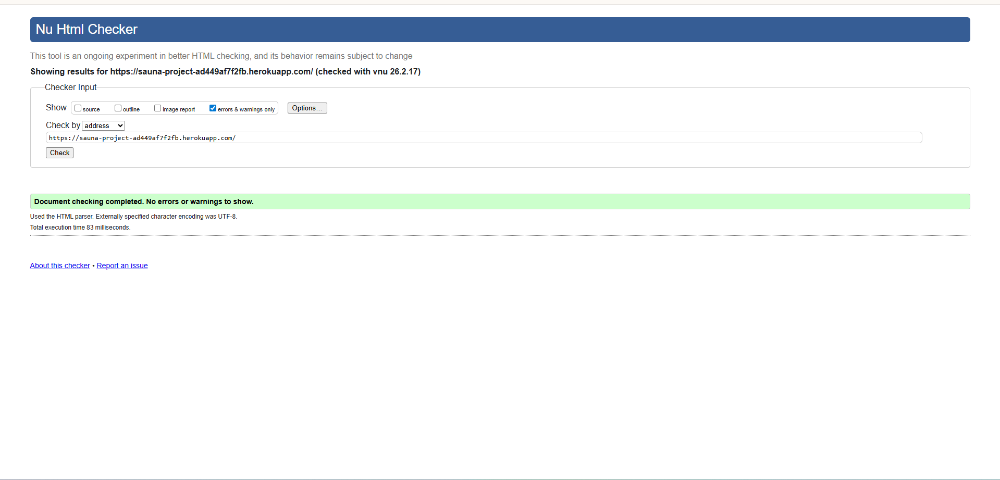
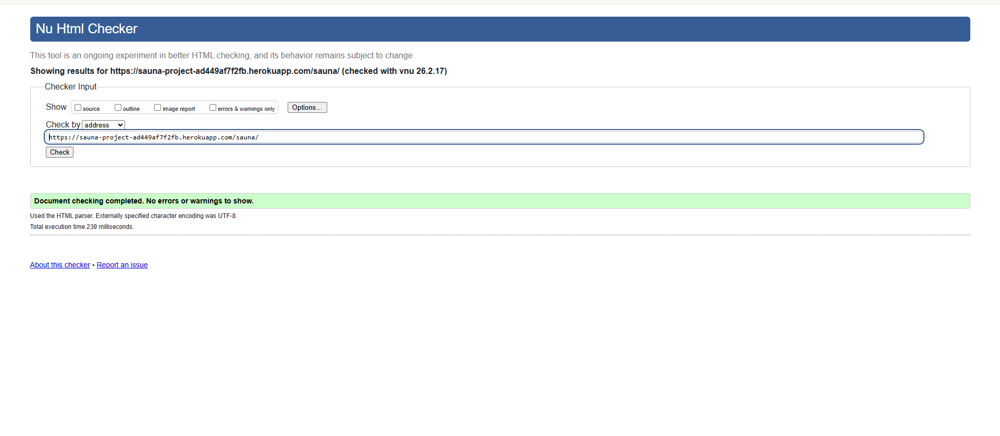
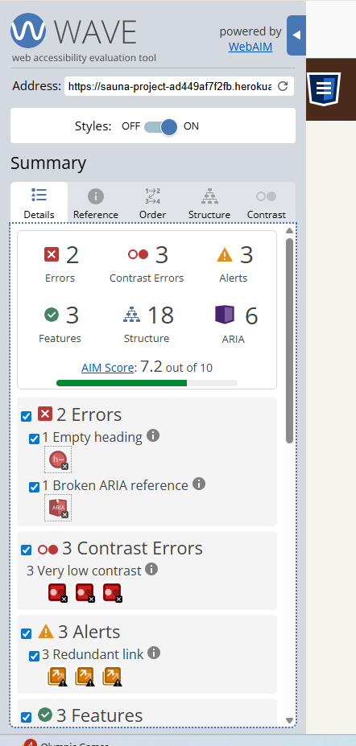
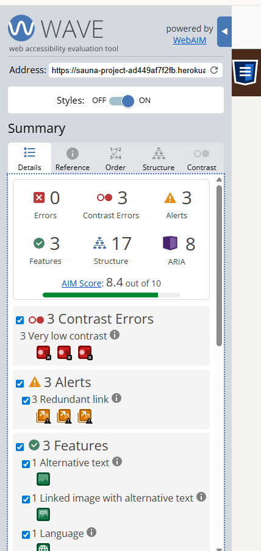
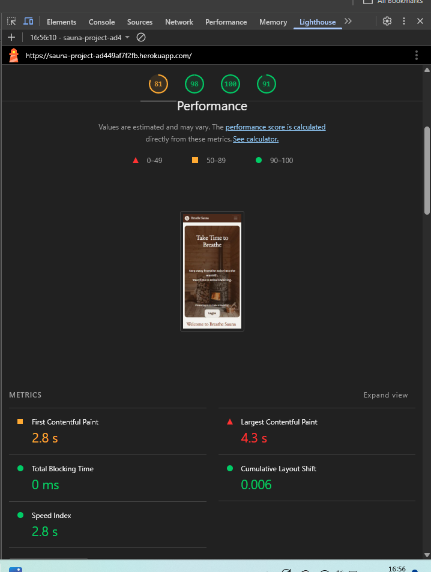
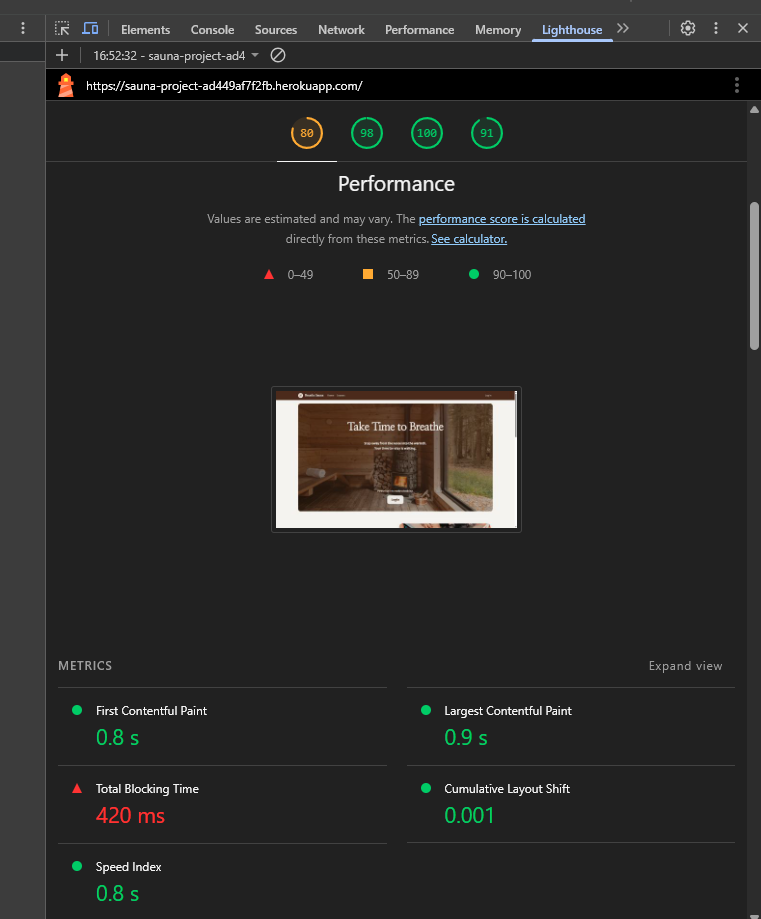

# Breathe Sauna


## Project Overview

[Breathe Sauna](https://sauna-project-ad449af7f2fb.herokuapp.com/)

Breathe Sauna is a full-stack Django booking application designed to provide users with a seamless and intuitive sauna reservation experience. The system enables users to register, securely log in, and book available time slots while ensuring that business rules — such as preventing overbooking and exceeding sauna capacity — are strictly enforced.

The application dynamically validates booking capacity, ensuring that multiple reservations can be made per time slot without surpassing the maximum number of guests allowed. Users can view sauna information, create and manage bookings, and update or cancel their reservations through an authenticated account system. Administrative functionality is handled via Django’s built-in admin panel, allowing management of saunas, time slots, and booking records.

The interface is fully responsive and adapts across mobile, tablet, and desktop devices to maintain usability and accessibility across different screen sizes.


## Project Rationale
This project was created to simulate a real-world booking system for a small business. Many booking systems are overly complex for single-location services. This project focuses on creating a streamlined, user-friendly experience that allows customers to reserve sessions quickly and reliably.

The application demonstrates backend development using Django, relational database design, form validation, authentication workflows, and responsive frontend design using Bootstrap.


[Contents]()

- [User Goals](#user-goals)
- [User Stories](#user-stories)
- [Website Goals and Objectives](#website-goals-and-objectives)
- [Wireframes](#wireframes)
- [Design Choices](#design-choices)
  - [Typography](#typography)
  - [Colour Scheme](#colour-scheme)
  - [Images](#images)
  - [Responsiveness](#responsiveness)
- [Features](#features)
  - [Existing Features](#existing-features)
  - [User Authentication](#user-authentication)
  - [Sauna Information Page](#sauna-information-page)
  - [Real-Time Validation (AJAX)](#real-time-validation-ajax)
  - [Booking System](#booking-system)
  - [My Bookings Dashboard](#my-bookings-dashboard)
  - [Admin Management Panel](#admin-management-panel)
  - [Responsive Design](#responsive-design)
  - [Future Enhancements](#future-enhancements)
- [Technologies Used](#tech-used)
  - [Languages](#languages)
  - [Libraries & Framework](#libraries-framework)
  - [Tools](#tools)
- [Data Schema](#data-schema)
- [Testing](#testing)
  - [Bugs Fixed](#bugs-fixed)
  - [Responsiveness Tests](#responsiveness-tests)
  - [Code Validation](#code-validation)
    - [HTML](#html)
    - [CSS](#css)
    - [Javascript](#javascript)
  - [User Story Testing](#user-story-testing)
  - [Feature Testing](#feature-testing)
  - [Accessibility Testing](#accessibility-testing)
  - [Lighthouse Testing](#lighthouse-testing)
  - [Browser Testing](#browser-testing)
- [Security Considerations](#security-considerations)
- [Defensive Programming](#defensive-programming)
- [Deployment](#deployment)
  - [To deploy the project](#deploy-project)
  - [To fork the project](#fork-project)
  - [To clone the project](#clone-project)
- [Credits](#credits)

## User Goals

- Book a sauna session quickly and easily

- View available time slots clearly

- Prevent accidental double bookings

- Receive confirmation feedback after booking

- Manage personal bookings

- Access the system on any device

- Use a secure login and registration system


## User Stories

- As a user, I want to create an account so I can book sauna sessions.

- As a user, I want to log in securely so my bookings are private.

- As a user, I want to see available time slots so I can choose a suitable session.

- As a user, I want to avoid booking conflicts so my reservation is guaranteed.

- As a user, I want to cancel bookings if my plans change.

- As a user, I want the site to work on mobile devices.

## Website Goals and Objectives

- Provide a simple and reliable booking system

- Prevent scheduling conflicts

- Offer clear and intuitive navigation

- Maintain strong security practices

- Deliver responsive performance across devices

- Provide admin tools for business management


## Target Audience

- Individuals booking personal wellness sessions

- Small sauna or spa businesses

- Users seeking a simple reservation system


## Wireframes


### UX Design

The wireframe for the Breathe Sauna project outlines a clean, calming, and user-focused booking experience across multiple screens, including Home, Our Saunas, Booking Form, Login, Register, and My Bookings. The design emphasizes simplicity and clarity, guiding users from learning about sauna benefits to selecting a sauna type, choosing a date and time, and managing their reservations. While the core layout and navigation structure remain consistent with the original concept, several elements evolved during development—such as refinements to the booking flow, updated form fields, and improved account management features—to enhance usability and responsiveness across devices. The overall wireframe reflects a minimal, wellness-inspired interface that supports an intuitive and seamless user journey.

 



## Design Choices

### Typography

The project uses a combination of Merriweather Sans and Nanum Myeongjo to create a balanced and visually cohesive design.

Merriweather Sans serves as the primary font for navigation, forms, and core interface elements. Its clean, modern sans-serif structure ensures excellent readability across all screen sizes, particularly in booking forms and menus where clarity is essential. The simplicity of the typeface reduces visual clutter and supports accessibility by allowing users to quickly scan and interpret important information.

Nanum Myeongjo is used as a complementary serif font to introduce warmth and elegance into headings and key content areas. Its refined, traditional style adds a subtle sense of calm and sophistication, reinforcing the wellness-focused identity of the sauna brand. The contrast between the structured sans-serif and the softer serif typography creates visual hierarchy while maintaining a welcoming and professional aesthetic.

Together, these fonts enhance usability, readability, and brand consistency across both desktop and mobile devices.


### Colour Scheme


The colour palette was designed to reflect the natural, calming environment associated with sauna experiences. Warm earthy browns were selected to represent wood and heat, reinforcing the physical materials and atmosphere of a traditional sauna. These tones are paired with soft neutral greys and muted green accents to evoke relaxation, balance, and nature.

This combination creates a calm and inviting visual identity that supports the wellness theme of the application. The colours are intentionally subdued to reduce visual strain and maintain a soothing user experience.


### Colour Psychology

The colour palette was chosen deliberately to reflect the emotional experience associated with sauna and wellness environments.

**Warm earthy browns** are strongly connected to feelings of warmth, comfort, and stability. These tones mimic natural wood and heat, which are core visual elements of traditional saunas. Psychologically, brown creates a sense of grounding and safety, helping users feel relaxed and secure while interacting with the booking system.

**Soft neutral tones** were included to balance the warmth of the browns. Neutral colours reduce visual fatigue and create a calm background that allows important interface elements, such as buttons and forms, to stand out clearly. This contributes to a stress-free browsing experience.

The **muted green accent** introduces an association with nature, health, and renewal. Green is widely linked to wellbeing and relaxation, reinforcing the spa-like atmosphere of the project. It subtly suggests freshness and rejuvenation, which aligns with the purpose of a sauna experience.

Together, these colours create a harmonious palette that promotes calmness, warmth, and trust. The psychological effect supports the project’s goal of providing a soothing and welcoming user experience, rather than an overstimulating or distracting interface.


I used [Contrast Grid](https://contrast-grid.eightshapes.com/ "Contrast Grid") to check effective color pairings that support readability and to identify combinations that may hinder legibility due to insufficient contrast or visual discomfort.


### Responsiveness

My App is responsive to all screen sizes. 
| Breakpoint | Class infix | Dimensions | | |
|-------------------|-------------|------------|---|---|
| Extra small | None | <576px | | |
| Small | sm | ≥576px | | |
| Medium | md | ≥768px | | |
| Large | lg | ≥992px | | |
| Extra large | xl | ≥1200px | | |
| Extra extra large | xxl | ≥1400px | | |


## Features


The Breathe Sauna website provides a clean, intuitive booking interface that allows users to quickly reserve sauna sessions. The layout is designed to minimise friction and guide users smoothly from browsing information to completing a booking.

The system uses a mobile-first responsive design, ensuring the booking experience works seamlessly across phones, tablets, and desktops.


## Existing Features

### User Authentication

Secure registration and login using Django’s built-in authentication system. Only logged-in users can create and manage bookings, protecting user data and preventing unauthorised access. Administrative access is restricted to authorised users through Django’s admin interface, maintaining secure management of saunas, time slots, and booking records.


### Sauna Information Page

A dedicated sauna information page displays details such as capacity, description, and price. This gives users a clear understanding of what they are booking before committing.


### Real-Time Validation (AJAX)

The application implements real-time validation using AJAX to provide instant feedback on sauna availability and remaining capacity, allowing users to see available spots before submitting their booking and reducing the risk of overbooking errors.

### Real-Time Feedback

When users attempt to create a booking, the system immediately checks for:

Past date selections

Double bookings

Capacity limits

Clear error messages are displayed if a rule is violated, helping users correct mistakes instantly.


### Booking System

Users can create bookings by selecting an available date and time slot. The form validates user input and prevents invalid reservations.

### My Bookings Dashboard

Users can view all their upcoming bookings in a personal dashboard. From here they can manage or cancel reservations easily.

### Admin Management Panel

Administrators can manage:

Sauna details

Available time slots

User bookings

User accounts

This allows full control over the booking system without modifying code.

### Responsive Design

The interface adapts smoothly to different screen sizes using Bootstrap, ensuring accessibility and usability across devices.

## Future Enhancements

### Online Payment Integration

Users could pay for their booking during checkout using a secure payment gateway, streamlining the reservation process.

### Email Booking Confirmations

Automatic confirmation emails could be sent after successful bookings, improving communication and professionalism.

###  Booking Reminders

Automated reminder notifications could reduce missed appointments.


## Technologies Used

### Languages

- HTML
- CSS
- Python
- JavaScript

### Libraries & Framework

- [Google Fonts](https://fonts.google.com/selection)
- Django
- Bootstrap
- Django Crispy Forms


### Tools

- [Github](https://github.com/)
- [Polypane](https://polypane.app/)
- [W3C HTML Validation Service](https://validator.w3.org/)
- [W3C CSS Validation Service](https://jigsaw.w3.org/css-validator/)
- [WAVE Accessibility Tool](https://wave.webaim.org/ "WAVE Accessibility Tool")
- [PostgreSQL](https://www.postgresql.org/)


##Data Schema

# Data Schema

## Overview
The sauna booking system uses three main data models to manage bookings: **Sauna**, **TimeSlot**, and **Booking**. These models work together to enable users to reserve sauna sessions for specific dates and times while preventing overbooking.

┌──────────────────────────┐
│           USER           │   
├──────────────────────────┤
│ id (PK)                  │
│ username                 │
│ email                    │
│ password                 │
│ is_staff                 │
│ is_active                │
│ date_joined              │
└─────────────┬────────────┘
              │
              │ 1 : N
              │ (a user can have many bookings)
              │
┌─────────────▼────────────┐
│          BOOKING         │
├──────────────────────────┤
│ id (PK)                  │
│ user_id (FK)             │ → USER.id
│ sauna_id (FK)            │ → SAUNA.id
│ time_slot_id (FK)        │ → TIMESLOT.id
│ booking_date             │
│ status                   │  pending|confirmed|cancelled|completed
│ number_of_guests         │
│ special_requests         │  (nullable)
│ created_at               │
│ updated_at               │
└───────────┬───────┬──────┘
            │       │
            │ N:1   │ N:1
            │       │
┌───────────▼───┐  ┌▼───────────────────────┐
│     SAUNA      │  │        TIMESLOT        │
├────────────────┤  ├────────────────────────┤
│ id (PK)        │  │ id (PK)                │
│ name           │  │ start_time             │
│ display_order  │  │ end_time               │
│ capacity       │  │ is_available           │
│ description    │  └────────────────────────┘
│ price_per_hour │
│ is_active      │
└────────────────┘

Constraints / Notes:
- TIMESLOT has UK (unique key): (start_time, end_time)
- Booking capacity rule (application-level):
  For a given (sauna, booking_date, time_slot),
  sum(number_of_guests) for status in {pending, confirmed}
  must be <= sauna.capacity.
- Booking cannot be in the past (validated in clean()).
- BOOKING.user is required in your model (NOT nullable).
  (So guest bookings are not supported unless you change user FK to null=True, blank=True.)

## Testing

## Bugs

| Category               | Details                                                                                                                         |
| ---------------------- | ------------------------------------------------------------------------------------------------------------------------------- |
| **Bug Description**    | Only one booking was allowed per sauna, date, and time slot.                                                                    |
| **Cause**              | A `unique_together` constraint on (`sauna`, `booking_date`, `time_slot`) prevented multiple bookings at database level.         |
| **Expected Behaviour** | Multiple bookings should be allowed per time slot, limited only by sauna capacity.                                              |
| **Fix Implemented**    | Removed the `unique_together` constraint and implemented capacity validation using `Sum()` aggregation in the `clean()` method. |
| **Learning Outcome**   | Gained understanding of the difference between database-level constraints and application-level business logic.                 |
| **Status**             | Resolved                                                                                                                        |

| Category               | Details                                                                                                       |
| ---------------------- | ------------------------------------------------------------------------------------------------------------- |
| **Bug Description**    | Users were able to collectively exceed sauna capacity for the same time slot.                                 |
| **Cause**              | Capacity validation did not account for the total number of guests across multiple bookings.                  |
| **Expected Behaviour** | Total guests across all bookings for a time slot should not exceed sauna capacity.                            |
| **Fix Implemented**    | Added aggregation logic using `Sum('number_of_guests')` to calculate existing guests before allowing booking. |
| **Learning Outcome**   | Improved understanding of query aggregation and server-side validation to prevent logical conflicts.          |
| **Status**             | Resolved                                                                                                      |

| Category               | Details                                                                                                    |
| ---------------------- | ---------------------------------------------------------------------------------------------------------- |
| **Bug Description**    | CSS and JavaScript files failed to load after deployment to Heroku.                                        |
| **Cause**              | WhiteNoise was not configured correctly in middleware and static settings.                                 |
| **Expected Behaviour** | Static assets should load correctly in production environment.                                             |
| **Fix Implemented**    | Installed WhiteNoise, updated middleware configuration, and ensured static settings were properly defined. |
| **Learning Outcome**   | Developed understanding of Django static file handling and production deployment configuration.            |
| **Status**             | Resolved                                                                                                   |

| Category               | Details                                                                                     |
| ---------------------- | ------------------------------------------------------------------------------------------- |
| **Bug Description**    | Application failed to connect to Heroku Postgres database after deployment.                 |
| **Cause**              | Local SQLite configuration was being used instead of environment-based database settings.   |
| **Expected Behaviour** | Application should connect to production database using `DATABASE_URL`.                     |
| **Fix Implemented**    | Integrated `dj_database_url` and updated `settings.py` to use environment variables.        |
| **Learning Outcome**   | Gained experience working with environment variables and production database configuration. |
| **Status**             | Resolved                                                                                    |

| Category               | Details                                                                                                                                      |
| ---------------------- | -------------------------------------------------------------------------------------------------------------------------------------------- |
| **Bug Description**    | HTML validator flagged invalid ARIA attributes in navigation toggle button.                                                                  |
| **Cause**              | Incorrect use of `aria-describedby` with plain text and unnecessary `role="navigation"` on button element.                                   |
| **Expected Behaviour** | Navigation should use semantic HTML with valid ARIA attributes.                                                                              |
| **Fix Implemented**    | Removed invalid ARIA attributes and implemented correct Bootstrap accessibility attributes (`aria-controls`, `aria-expanded`, `aria-label`). |
| **Learning Outcome**   | Improved understanding of semantic HTML and proper ARIA usage for accessibility compliance (WCAG).                                           |
| **Status**             | Resolved                                                                                                                                     |

## Bug testing reflection

The initial use of a unique_together constraint highlighted a misunderstanding between database-level constraints and business logic requirements. Refactoring this to implement capacity validation using Django ORM aggregation (Sum) improved the system design and ensured bookings were limited by sauna capacity rather than a restrictive uniqueness rule. This demonstrates an improved understanding of relational databases and server-side validation.

Deployment issues, including static file configuration and database connection errors, required the implementation of WhiteNoise and environment-based database settings using dj_database_url. Resolving these issues strengthened understanding of production configuration, environment variables, and the differences between local and deployed environments — a key full-stack development competency.

Accessibility-related validation errors further improved awareness of semantic HTML and correct ARIA implementation, ensuring compliance with WCAG 2.2 standards and improving overall usability.

Overall, resolving these bugs reflects a clear progression in technical understanding, particularly in database design, defensive validation, deployment configuration, and accessibility best practices. The debugging process contributed directly to a more robust, secure, and production-ready application.


### Responsiveness Tests


| Device / Screen Size | Expected Behaviour                      | Actual Result                                     | Pass/Fail | Notes             |
|----------------------|-----------------------------------------|---------------------------------------------------|-----------|-------------------|
| iPhone SE            | Layout fits screen, buttons easy to tap | Works as expected                                 | Pass      |                   |
| iPhone 14            | No overflow, text readable              | Works as expected                                 | Pass      |                   |
| Pixel 9              | Buttons scale correctly, no clipping    | button sticks to bottom of hero image                                | Fail      |  Work in progress    |
| iPad            | Layout expands but stays centred        | p text higher than expected                               | Fail     |  Work in progress                 |
| iPad Pro             | Content does not stretch too wide       | Works as expected    | Pass     |           |
| Nest Hub             | Fully readable, centred content         | Works as expected                                 | Pass      |                   |
| Next Hub Max         | Max-width applied, UI stable            | Works as expected | Pass    |       |


## Manual Testing ()

### User Story BDD Testing

### User Story 1 — Register an account

| Category | Details |
|---------|---------|
| **User Story** | As a user, I want to create an account so I can book sauna sessions. |
| **Scenario** | Account registration |
| **Given** | The user is on the registration page |
| **When** | They enter valid details and submit the form |
| **Then** | A new account is created and the user is redirected with a success message |
| **Result** | Pass |
| **Evidence** | [Screenshot of successful registration](docs/ust-validation-1.png) |

---

### User Story 2 — Log in securely

| Category | Details |
|---------|---------|
| **User Story** | As a user, I want to log in securely so I can access my bookings. |
| **Scenario** | User login |
| **Given** | The user has a registered account |
| **When** | They enter correct login credentials |
| **Then** | They are logged in and redirected to the dashboard/home page |
| **Result** | Pass |
| **Evidence** | [Screenshot of login success](docs/ust-validation-2-login.png) [Screenshot of login success](docs/ust-validation-2-logged-in.png)|

---

### User Story 3 — Book a sauna session

| Category | Details |
|---------|---------|
| **User Story** | As a user, I want to book an available sauna time slot so I can reserve a session. |
| **Scenario** | Creating a booking |
| **Given** | The user is logged in and on the booking page |
| **When** | They select a valid date and time slot and submit the form |
| **Then** | The booking is saved and confirmation is displayed |
| **Result** | Pass |
| **Evidence** | [Screenshot of successful booking](docs/ust-validation-3.png) |

---

### User Story 4 — Prevent double bookings

| Category | Details |
|---------|---------|
| **User Story** | As a user, I want the system to prevent double bookings so my reservation is guaranteed. |
| **Scenario** | Attempt duplicate booking |
| **Given** | A time slot is already booked |
| **When** | The user attempts to book the same slot |
| **Then** | An error message is displayed and the booking is rejected |
| **Result** | Pass |
| **Evidence** | [Screenshot of booking validation error](docs/ust-validation-4.png) |

---

### User Story 5 — View and manage bookings

| Category | Details |
|---------|---------|
| **User Story** | As a user, I want to view and cancel my bookings so I can manage my schedule. |
| **Scenario** | Viewing personal bookings |
| **Given** | The user is logged in |
| **When** | They navigate to the “My Bookings” page |
| **Then** | All their bookings are displayed clearly |
| **Scenario** | Cancelling a booking |
| **Given** | A booking exists |
| **When** | The user clicks cancel/delete |
| **Then** | The booking is removed and a confirmation message appears |
| **Result** | Pass |
| **Evidence** | [Screenshot of bookings dashboard](docs/ust-validation-5-cancel-page.png) [Screenshot of bookings deleted successfully](docs/ust-validation-5-confirmed-cancelation.png) |

---

### User Story 6 — Accessible on any device

| Category | Details |
|---------|---------|
| **User Story** | As a user, I want to access the booking system on any device so I can book anywhere. |
| **Scenario** | Responsive layout |
| **Given** | The site is opened on different screen sizes |
| **When** | The display changes between mobile, tablet, and desktop |
| **Then** | All elements remain readable and functional |
| **Result** | Pass |
| **Evidence** | [Responsive screenshots](docs/ust-validation-6.png) |

## Security Considerations

Security was considered throughout development and deployment.

The following measures were implemented:

- Django’s built-in authentication system for secure user registration and login.
- Booking functionality restricted to authenticated users only.
- Admin panel access limited to users with `is_staff` privileges.
- Environment variables used to store secret keys and database credentials.
- Sensitive files excluded via `.gitignore`.
- `DEBUG` mode disabled in production.
- Production database configured using `DATABASE_URL`.
- CSRF protection enabled via Django middleware.

### Admin Access Testing

| Test Case           | Description                                                          |
| ------------------- | -------------------------------------------------------------------- |
| **Test Objective**  | Verify that unauthorised users cannot access the Django admin panel. |
| **Steps Taken**     | Logged in as a non-staff user and attempted to access `/admin/`.     |
| **Expected Result** | Access denied and user prompted to log in with a staff account.      |
| **Actual Result**   | Access was denied as expected.                                       |
| **Status**          | Pass                                                                 |
| **Evidence**        | [Screenshot](docs/admin-acess-testing.png) |

This confirms that Django’s built-in permission system correctly restricts admin access to users with appropriate privileges.

## Code Validation

### CSS

I have used [W3C CSS Validation Service](https://jigsaw.w3.org/css-validator/). There were no errors.



### HTML

I have used [W3C HTML Validation Service](https://validator.w3.org/). The tests came back with 11 errors. I fixed the HTML validation errors shown in the images above, mainly related to incorrect ARIA references. I tested all publicly accessible pages using the validator. The pages within the booking system require login, so I was unable to validate them directly; however, they use the same base template as the validated pages.



### Javascript 

The file `booking-validation.js` was validated by ESLint through VSCode plug-in. ESLint was used to ensure code quality and identify potential issues during development. 0 errors was identified.


## Accessibility Testing

I used the web accessibilty evalution tool [WAVE](https://wave.webaim.org/).

A WAVE accessibility evaluation was conducted to assess ARIA implementation and overall compliance with accessibility standards. The results indicate 0 accessibility errors, 3 contrast errors, and 3 alerts, with an overall AIM score of 8.4 out of 10.

Previously identified issues relating to incorrect ARIA references and an empty <head> element have been successfully resolved. Correcting the ARIA reference errors ensured that all ARIA attributes properly correspond to valid element IDs, improving assistive technology compatibility. The removal of the empty <head> tag error also ensured proper document structure and HTML validity.

The remaining issues consist of three low colour contrast warnings. These contrast ratios cannot be modified due to established design constraints. Aside from these contrast limitations, the page demonstrates appropriate semantic structure, correct ARIA implementation, and adherence to accessibility best practices.

The pages within the booking system require user authentication and therefore could not be directly tested using the WAVE accessibility tool; however, they are built using the same base template and accessibility structure as the pages that were successfully evaluated.

Overall, the accessibility evaluation confirms that structural and ARIA-related issues have been addressed, with only minor contrast-related limitations remaining.



 


## Feature Testing

This website was extensively tested for functionality using Chrome developer tools.

## Lighthouse Testing

The Breathe Sauna Project has been tested in Chrome Dev Tools using Lighthouse Testing tool, which inspects and scores the website for the following criteria. I generated two sets of lighthouse reports, one for mobile and one for desktop. The application achieved high Lighthouse scores across Performance, Accessibility, Best Practices, and SEO on both mobile and desktop testing.


- Performance - how quickly a website loads and how quickly users can access it.
- Accessibility - test analyses how well people who use assistive technologies can use your website.
- Best Practices - checks whether the page is built on the modern standards of web development.  
- SEO - checks if the website is optimised for search engine result rankings.

## Mobile chrome Dev tools testing:

 

## Desktop chrome Dev tools testing:

 

## Known Issues / Limitations

Although the application is fully functional and stable in its deployed state, several minor limitations were identified during testing and evaluation. Responsive testing revealed small layout inconsistencies on specific devices (e.g., button positioning on Pixel 9 and text alignment variations on certain iPad breakpoints). These issues are cosmetic rather than functional and do not impact booking logic, data integrity, or user authentication. Further CSS refinement and breakpoint optimisation would fully resolve these discrepancies.

Accessibility testing using WAVE identified low colour contrast warnings. While the current palette aligns with the project’s wellness-focused brand identity, minor adjustments could improve WCAG compliance without significantly altering the visual design. This trade-off between branding and accessibility was considered during evaluation.

In terms of functionality, the current implementation does not include integrated online payment processing or automated booking confirmation emails. These features were intentionally scoped as future enhancements to prioritise core CRUD functionality, security, and validation logic during initial development.

All identified limitations have been documented transparently. Importantly, none affect the robustness, security, or business-rule enforcement of the booking system. The application remains stable, secure, and aligned with its intended purpose, while leaving clear opportunities for future iteration and scalability.


## Defensive Programming

Defensive programming principles were applied throughout development to ensure the system handles errors gracefully and maintains data integrity.

### Validation & Data Protection Measures

The application implements:

- **Server-side validation** to prevent bookings in the past.
- **Aggregation validation** using `Sum()` to prevent exceeding sauna capacity.
- **Authentication checks** to restrict booking creation to logged-in users.
- **Permission enforcement** to prevent unauthorised admin access.
- **Graceful error messaging** to inform users of validation failures.
- **Environment variable protection** for sensitive configuration.

All user input is validated before database operations are performed. Where validation fails, the system provides clear and actionable feedback rather than exposing internal errors.

### Outcome

This approach ensures that:

- Business rules cannot be bypassed.
- Logical conflicts are prevented.
- The application remains stable under incorrect user input.

## Version Control Strategy

### Version Control and Development Process

The project was developed using **Git** for version control throughout the development lifecycle.

Development followed industry best practice by:

- Making **small, incremental commits** for individual features and bug fixes.
- Writing **clear, descriptive commit messages** that explain the purpose of each change.
- Avoiding large commits that obscure development history.
- Maintaining a logical and traceable development timeline.

Each major feature — including authentication, booking validation, deployment configuration, and accessibility fixes — was committed separately. This approach allows clear tracking of progress and demonstrates an iterative development process.

The structured commit history provides transparency in development and aligns with professional software engineering standards.

## Deployment

### Deploying to Heroku

The **Breathe Sauna Booking System** was deployed using **Heroku**, a cloud platform that allows Django applications to run in a production environment.

---

### Prerequisites

Before deployment, ensure the following are set up:

- A Heroku account
- Git installed
- Heroku CLI installed
- A PostgreSQL database configured
- A `requirements.txt` file
- A `Procfile`
- Environment variables stored securely

---

### Step 1: Prepare the Project for Deployment

#### 1. Install Gunicorn

Gunicorn is a production web server required by Heroku.

```
pip install gunicorn
```

Update requirements:

```
pip freeze > requirements.txt
```

---

#### 2. Create a Procfile

In the root directory of the project, create a file named:

```
Procfile
```

Add the following line:

```
web: gunicorn breathe_config.wsgi
```

(This tells Heroku how to run your Django app.)

---

#### 3. Update Settings for Production

In `settings.py`:

- Set `DEBUG = False`
- Add your Heroku app URL to `ALLOWED_HOSTS`
- Configure environment variables using `.env` or Heroku config vars

Example:

```
ALLOWED_HOSTS = ["your-app-name.herokuapp.com"]
```

---

### Step 2: Create Heroku App

Login to Heroku:

```
heroku login
```

Create a new app:

```
heroku create your-app-name
```

---

### Step 3: Add PostgreSQL Database

```
heroku addons:create heroku-postgresql:hobby-dev
```

Heroku automatically sets the database URL environment variable.

---

### Step 4: Deploy to Heroku

Commit your changes:

```
git add .
git commit -m "Prepare for Heroku deployment"
```

Push to Heroku:

```
git push heroku main
```

---

### Step 5: Run Migrations

```
heroku run python manage.py migrate
```

Create a superuser:

```
heroku run python manage.py createsuperuser
```

---

### Step 6: Open the App

```
heroku open
```

Your application is now live.

---

### Redeploying After Changes

Any time updates are made:

```
git add .
git commit -m "Update project"
git push heroku main
```

Heroku automatically rebuilds and redeploys the app.

---

### To Fork the Project

Forking the repository creates a personal copy for experimentation or development.

- Log in to GitHub
- Navigate to the repository
- Click **Fork** (top right)
- The project is copied to your account

---

### To Clone the Project

- Log in to GitHub
- Open the repository page
- Click **Code**
- Copy the repository URL
- In your terminal:

```
git clone <repository-url>
```

- Open the project in your IDE


## Credits

- Code inspiration and learning content:
- Visual content:
  - [Coolors](https://coolors.co/)
  - [Contrast Grid](https://contrast-grid.eightshapes.com/?version=1.1.0&background-colors=&foreground-colors=%23FFFFFF%2C%20White%0D%0A%23F2F2F2%0D%0A%23DDDDDD%0D%0A%23CCCCCC%0D%0A%23888888%0D%0A%23404040%2C%20Charcoal%0D%0A%23000000%2C%20Black%0D%0A%232F78C5%2C%20Effective%20on%20Extremes%0D%0A%230F60B6%2C%20Effective%20on%20Lights%0D%0A%23398EEA%2C%20Ineffective%0D%0A&es-color-form__tile-size=compact&es-color-form__show-contrast=aaa&es-color-form__show-contrast=aa&es-color-form__show-contrast=aa18&es-color-form__show-contrast=dnp)
  - [Pexels](https://www.pexels.com/)
  - [Unsplash](https://unsplash.com/)

- learning content:
  - [Corey Schafer Django Tutorials](https://www.youtube.com/playlist?list=PL-osiE80TeTtoQCKZ03TU5fNfx2UY6U4p) 


  
 